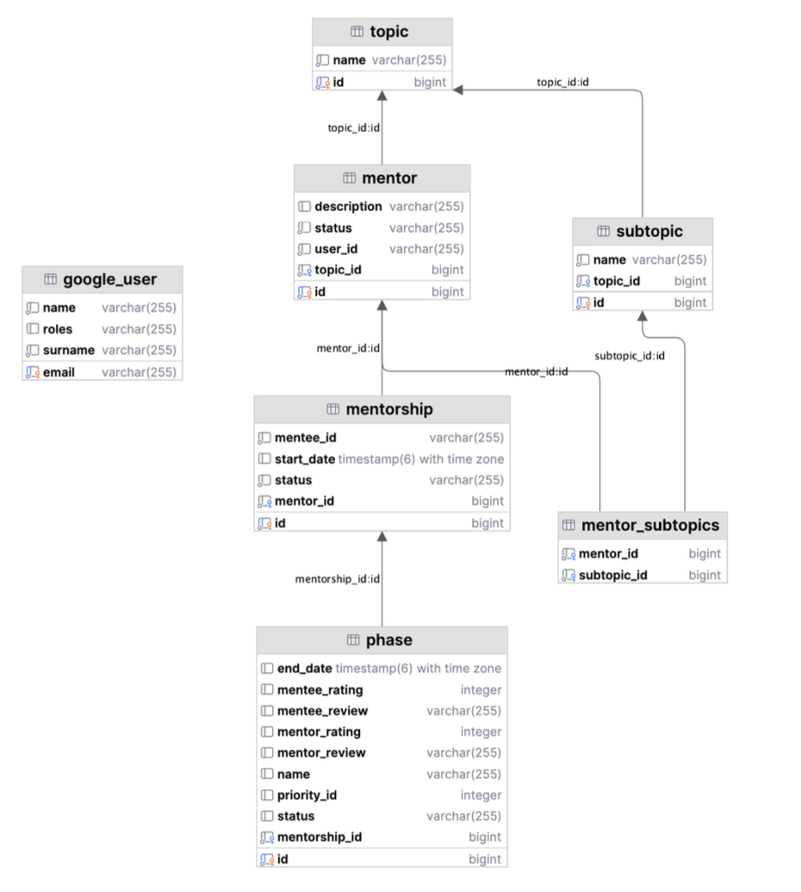
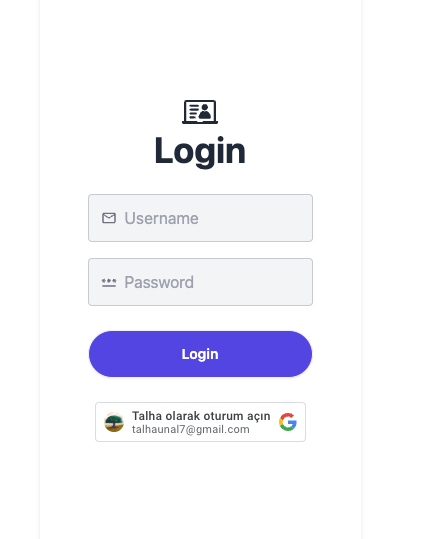
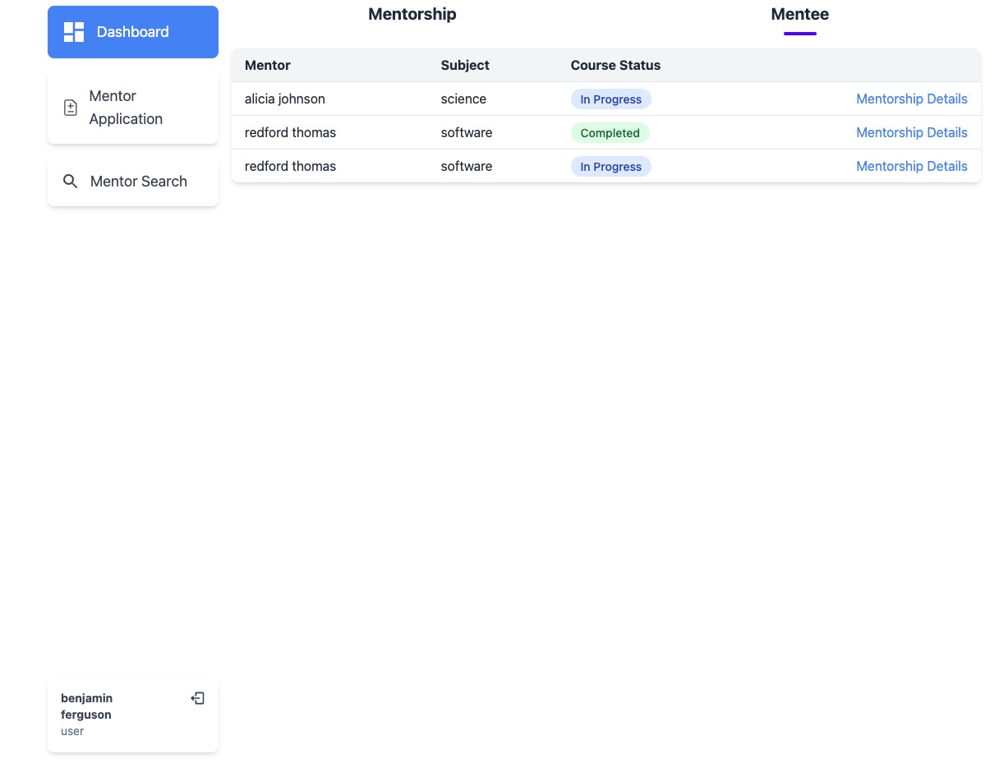
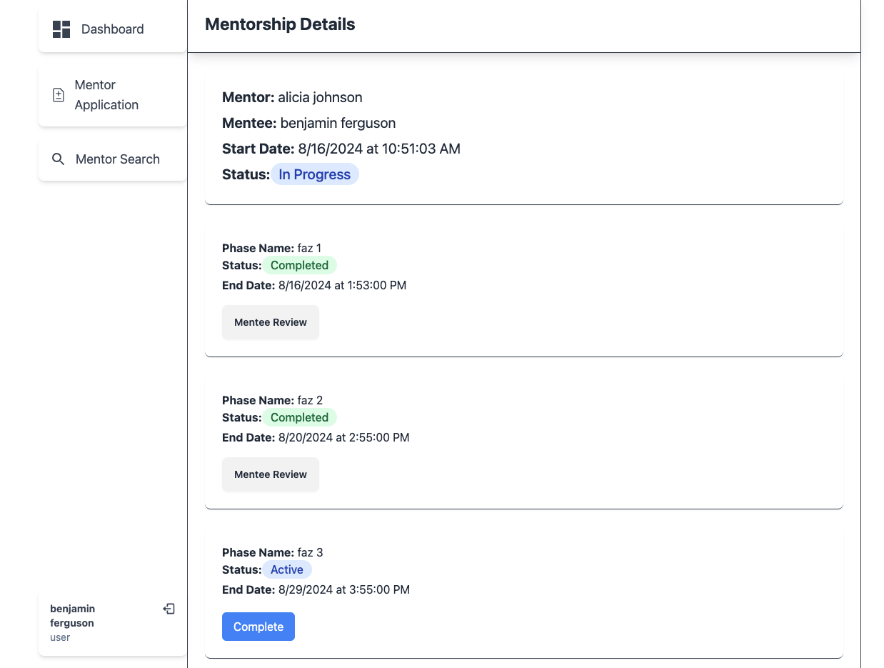
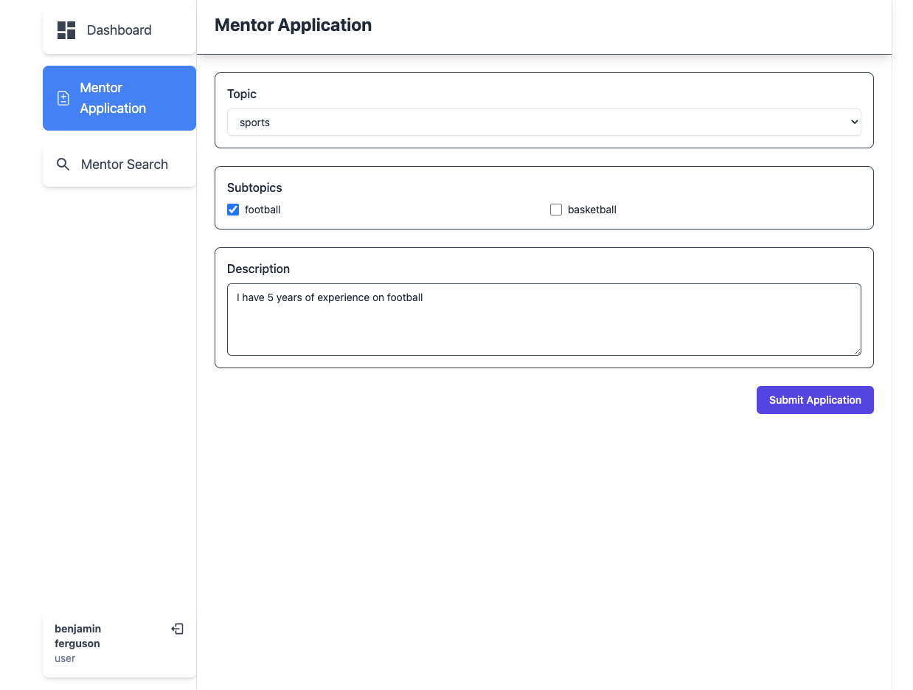

# Mentor Flow

This project was developed during the [OBSS Technology](https://obss.tech/tr/) internship program, and completed within a period of 1 month.

## About The Project

The project is a mentorship platform connecting users to offer or receive mentorship in various areas of expertise.

* The platform supports two user types: Admins and general users (mentors and mentees).
  * Admins manage mentorship applications, while users can apply as mentors or search for mentors in specific topics.

* Authentication is via LDAP or Google accounts.

* After login, users access a personalized dashboard:
  * Admins review and approve mentorship applications.
  * General users track their mentorship processes and view details about ongoing or completed mentorships.

* Mentors apply by selecting topics and providing expertise details. Mentees search for mentors using a topic-based or free-text search.

* The mentorship process is managed in phases, with evaluations at the end of each phase, and automated email reminders for phase deadlines.

### Technologies Used
 
> ### Backend
> [Spring Boot](https://spring.io/projects/spring-boot) -
> [Spring Security](https://spring.io/projects/spring-security) -
> [Spring Boot Starter Mail](https://spring.io/projects/spring-boot) -
> [PostgreSQL](https://www.postgresql.org/) -
> [Spring Data JPA](https://spring.io/projects/spring-data-jpa) -
> [Elasticsearch](https://www.elastic.co/elasticsearch/)
---
> ### Frontend
> [React](https://react.dev/) -
> [Vite](https://vitejs.dev/) -
> [react-oauth/google](https://www.npmjs.com/package/@react-oauth/google) -
> [tanstack/react-query](https://tanstack.com/query/latest) -
> [react-router-dom](https://reactrouter.com/en/main)

## API Endpoints

### /auth

| Endpoint                  | Method | Description                              |
|---------------------------|--------|------------------------------------------|
| `/api/login`              | POST   | Login with username and password         |
| `/oauth/login`            | POST   | Login with Google                        |
| `/api/verify-token`       | GET    | Verify the validity of the token         |
| `/api/logout`             | POST   | Logout the current user                  |

### /mentors

| Endpoint                                              | Method | Description                                    |
|-------------------------------------------------------|--------|------------------------------------------------|
| `/api/mentors`                                        | POST   | Create a mentor                                |
| `/api/mentors`                                        | GET    | Get all mentors                                |
| `/api/mentors/query?query=football`                   | GET    | Search mentors based on ElasticSearch query    |
| `/api/mentors/{id}`                                   | GET    | Get mentor by ID                               |
| `/api/mentors/{id}/status`                            | POST   | Change mentor status (approve/reject)          |
| `/api/mentors/search?topicId=5&subtopicIds=1,3`       | GET    | Search mentors by topic and subtopics          |

### /mentorships

| Endpoint                                              | Method | Description                                    |
|-------------------------------------------------------|--------|------------------------------------------------|
| `/api/mentorships/pick-mentor/{id}`                   | POST   | Pick a mentor for mentorship                   |
| `/api/mentorships/{id}`                               | GET    | Get mentorship by ID                           |
| `/api/mentorships/mentor-processes`                   | GET    | Get mentor processes                           |
| `/api/mentorships/mentee-processes`                   | GET    | Get mentee processes                           |

### /topics & /subtopics

| Endpoint                                              | Method | Description                                    |
|-------------------------------------------------------|--------|------------------------------------------------|
| `/api/topics`                                         | GET    | Get all topics                                 |
| `/api/topics`                                         | POST   | Create a new topic                             |
| `/api/subtopics/{id}`                                 | GET    | Get subtopics by topic ID                      |
| `/api/subtopics`                                      | POST   | Create a new subtopic                          |

### /phases

| Endpoint                                              | Method | Description                                    |
|-------------------------------------------------------|--------|------------------------------------------------|
| `/api/phases`                                         | POST   | Create a new phase                             |
| `/api/phases/{id}`                                    | GET    | Get phases by mentorship ID                    |
| `/api/phases/{id}/completion`                         | PUT    | Complete a phase                               |

 

## Database Diagram

## Website

